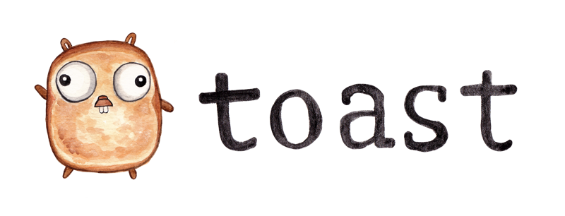

[](https://godoc.org/github.com/Fanatics/toast)

`toast` is a plugin-driven code generation tool that parses regular [Go](https://golang.org) code, rather than an IDL like Protobufs or other common defintion code.

## Why?
Fanatics loves Go, we have a lot of Go code, and after using plenty of other code generation tools, it struck us that Go code as an IDL could be a nice alternative. 

`toast` makes it much easier to generate code from your Go code, since it gives you pre-parsed AST-like data about your packages and files. Why the name "toast", you ask? `toast` is a tool to turn your Go code "to AST" in a helpful way. 

## Usage

```sh
$ toast --input . \
    --plugin amdm_gen_db:out=./internal/db \   
    --plugin "amdm_gen_proto --option1 value1 -o v2:out=./api/proto"
```

> See a basic [**example plugin**](https://github.com/Fanatics/toast/blob/master/plugin-samples/toast-plugin/main.go) written in Go.

## Installation

If you have Go installed, run:
```sh
$ go get github.com/Fanatics/toast/...
```

Once the project is at a more stable point, pre-built binaries will be made 
available for download across common platforms.

## Status
`toast` is still under heavy development. Tests are still being written, APIs 
will change without notice. However, feel free to give it a spin, open issues and submit PRs. 

The simplified AST that is sent to a plugin's stdin may (and probably should) change from version to version. It is incomplete, and once tests are ready, we will have a better idea of what else is left to parse and collect. 

**Please open issues if/when you encounter incompleteness or errors!**


## Disclaimer
This is not an official Fanatics product (experimental or otherwise), it is just code that happens to be owned by Fanatics.

<p align="right">
    <br/>   
    Want to work on projects like this?
    <a href="mailto:smanuel@fanatics.com">
        Get in touch.
    </a>
</p>